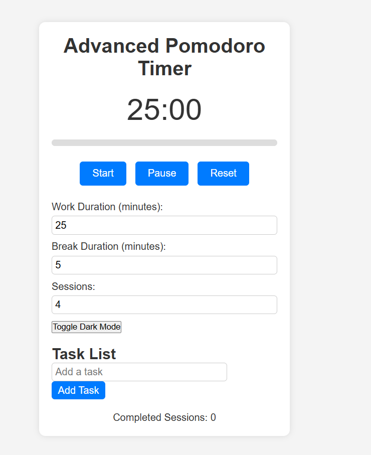

# Pomodoro Timer

A simple and elegant Pomodoro Timer built with **HTML, CSS, and JavaScript**. This app helps you manage your work and break sessions effectively using the Pomodoro Technique.

 <!-- Add a screenshot if you have one -->

---

## Features

- **Work and Break Sessions**: Set custom durations for work and break sessions.
- **Start, Pause, and Reset**: Control the timer with intuitive buttons.
- **Progress Bar**: Visualize the progress of the current session.
- **Sound Notifications**: Get notified with a beep sound when a session ends.
- **Responsive Design**: Works seamlessly on all devices (desktop, tablet, mobile).
- **Dark Mode**: Toggle between light and dark themes.

---

## How to Use

1. **Set Durations**:
   - Enter the work and break durations in minutes using the input fields.
2. **Start the Timer**:
   - Click the **Start** button to begin the timer.
3. **Pause or Reset**:
   - Use the **Pause** button to pause the timer or the **Reset** button to reset it.
4. **Switch Modes**:
   - The timer automatically switches between work and break sessions.
5. **Dark Mode**:
   - Toggle dark mode using the **Toggle Dark Mode** button.

---

## Technologies Used

- **HTML**: For the structure of the app.
- **CSS**: For styling and responsiveness.
- **JavaScript**: For timer logic and interactivity.

---

## Installation

1. Clone the repository:
   git clone https://github.com/RupeshSangoju/Pomodoro.git
2. Navigate to the project directory:
   cd pomodoro-timer
3. Open the index.html file in your browser:
   open index.html

Customization
Change Sounds:

Replace the beep-sound.mp3 file with your preferred sound.

Modify Durations:

Update the default work and break durations in the JavaScript file.

Add Features:

Extend the app by adding new features like multiple sessions, task lists, or analytics.

License
This project is licensed under the MIT License. See the LICENSE file for details.

Acknowledgments
Inspired by the Pomodoro Technique.

Live Demo
Check out the live demo https://pomodoro-xi-six.vercel.app/  here.